# Phishing Detection using SIEM (Splunk)

## Overview
 This project simulates a real-world phishing attack scenario and demonstrates how a Security Operations Center (SOC) analyst can detect, analyze, and respond to phishing threats using SIEM tools.
 The project involves collecting phishing URLs, validating them using threat intelligence, creating a dataset, and analyzing it in Splunk to detect malicious activity and user compromise.

## Objectives
-Detect phishing emails and malicious URLs
-Identify targeted users and compromised activity
-Analyze phishing infrastructure (domains)
-Build alerts for real-time detection
-Visualize threats using dashboards

## Tools & Technologies Used
-Splunk (SIEM)
-Kali Linux
-PhishTank (Phishing URL source)
-VirusTotal (Threat Intelligence)

## Project Workflow
  ### Data Collection
  -Collected phishing URLs from PhishTank
  -Gathered ~25–30 malicious URLs

### Data Collection (PhishTank)
  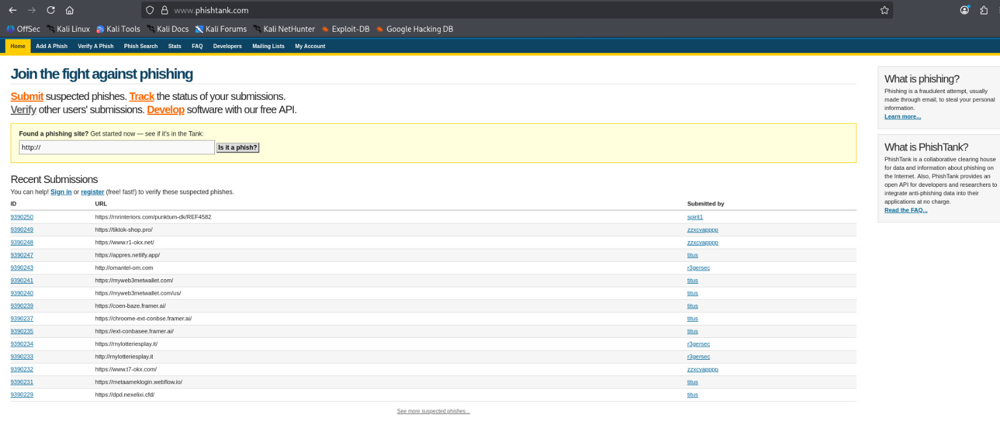

### Threat Intelligence Validation
  -Validated selected URLs using VirusTotal
  -Confirmed phishing/malicious indicators

###  URL Validation (VirusTotal)
  -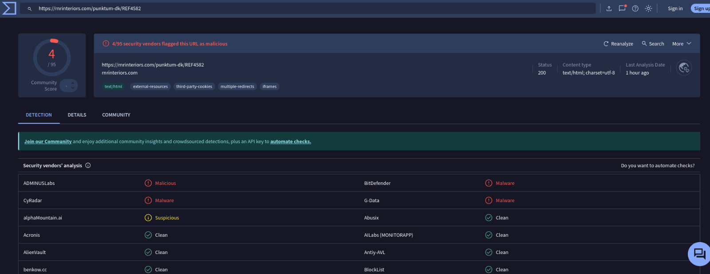
  -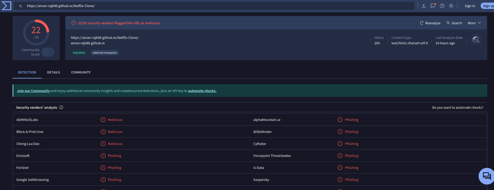
  -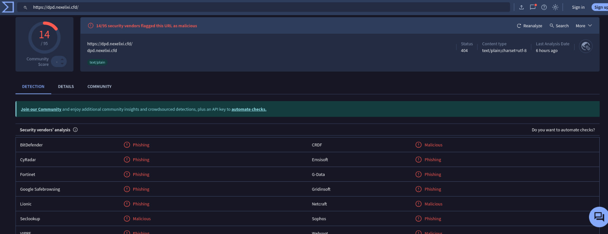

 ### Dataset Creation
  Created custom log dataset (phishing_logs.csv)
  Included:
  - Sender email
  - Recipient
  - URL
  - Action (clicked/delivered)
 Added normal traffic logs to simulate real-world environment
 Duplicated selected phishing logs to simulate attack patterns

 ### Dataset Preview
   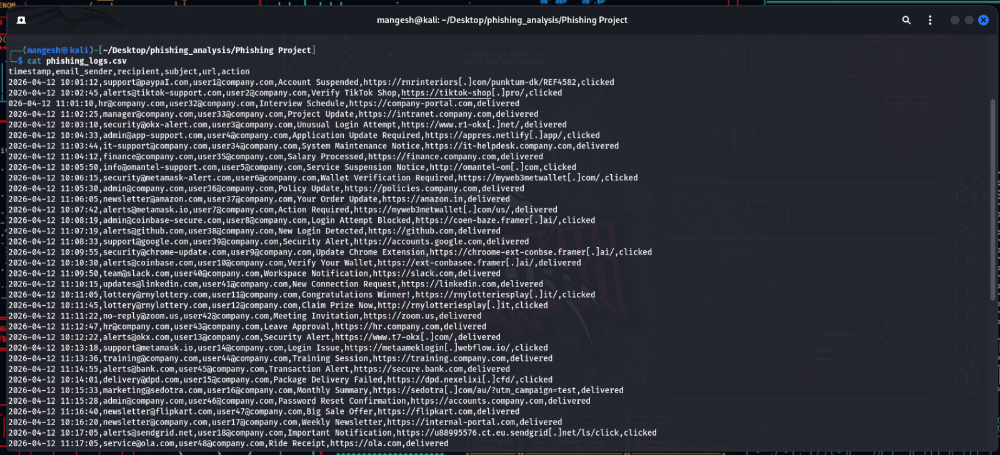

 ### 4. Data Ingestion (Splunk)
  -Uploaded dataset into Splunk
  -Created custom index: phishing_logs

### 5. Detection & Analysis

 Key Queries Used:
 
 1. All Logs
 index=phishing_logs
 
 3. Phishing Click Detection
 index=phishing_logs action="clicked"

 4. Suspicious Senders
 index=phishing_logs
 | stats count by email_sender
 | sort -count

 5. Top Targeted Users
 index=phishing_logs action="clicked"
 | stats count by recipient
 | sort -count

 6. Top Malicious Domains
 index=phishing_logs
 | stats count by url
 | sort -count

 ## 📸 Detection Queries

 ### Phishing Click Detection
 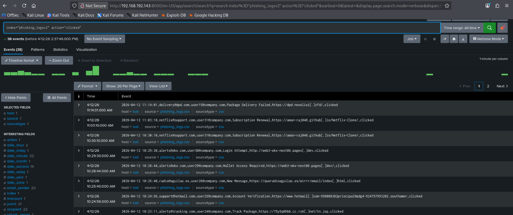

 ### Suspicious Senders
 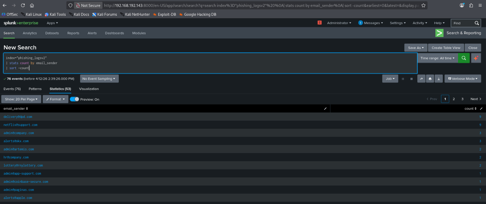

 ### Top Targeted Users
 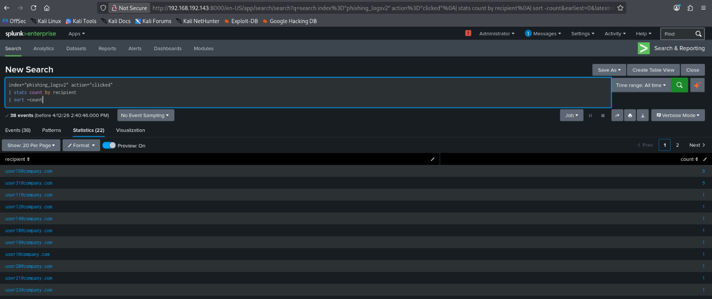

 ### Top Malicious Domains
 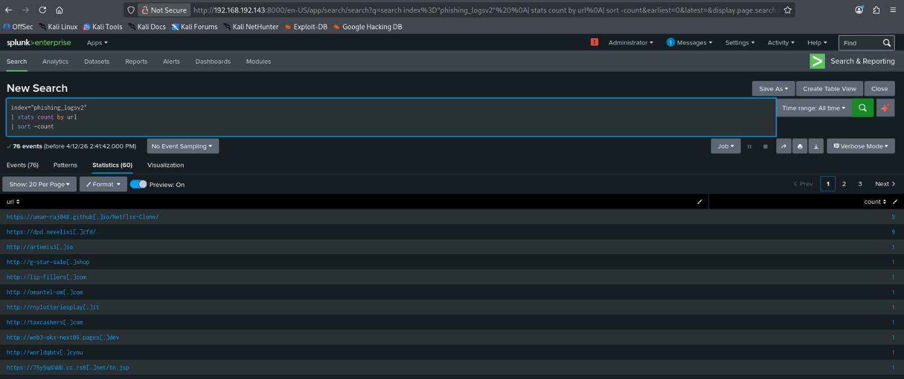
 
 ## 6. Alert Creation

-Created alert: “Phishing Link Click Detected”
-Trigger condition: when users click phishing links
-Logged events for monitoring and response

## 📸 Alert Configuration
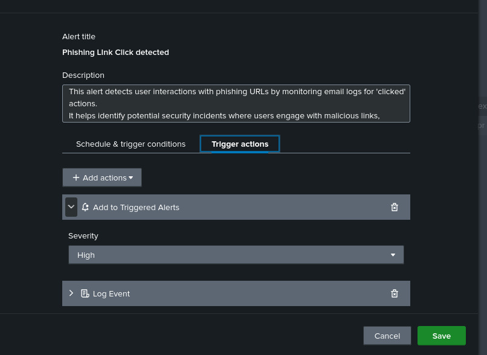

## 7. Dashboard Creation

Built a SIEM Dashboard with the following panels:

- Total Phishing Link Clicks
- Top Targeted Users
- Top Malicious Domains
- Email Activity Overview
- Screenshots

## Include screenshots of:

- PhishTank data collection
- VirusTotal validation
- Splunk queries
- Alert configuration
- Final dashboard

## Final Dashboard

 ##  Final Dashboard
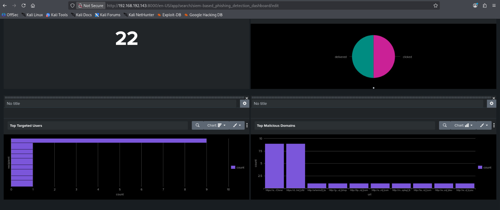

## Key Learnings
-Understanding phishing attack patterns
-Working with SIEM tools (Splunk)
-Writing detection queries (SPL)
-Creating alerts for security incidents
-Building dashboards for threat monitoring
